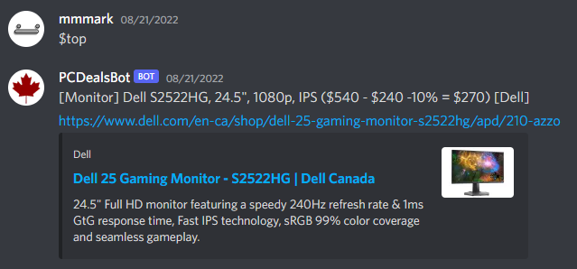

# PCDealsBot
Discord bot that automatically forwards newest deals from r/bapcsalescanada  
  
**To run the bot:**  
1. Set up environment variables  
2. pip install -r requirements.txt  
3. python main.py  

**FEATURES:**  
1. **Top Post**  
When prompted with $top, the bot will forward the top deal from today (as per Reddit's rankings). Example below.  
  
2. **New Posts**  
So long as the bot is running, it will continue to send new deals to its configured channel(s). Example below.  

